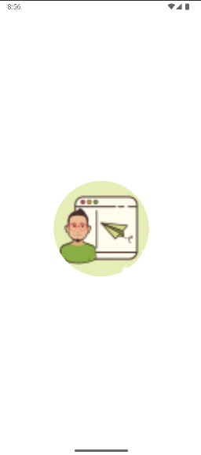
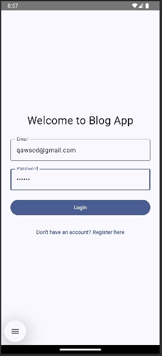
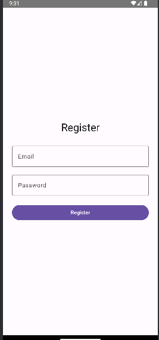
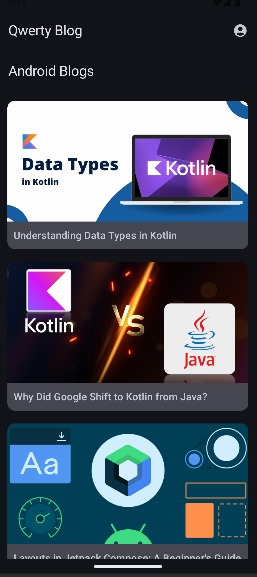
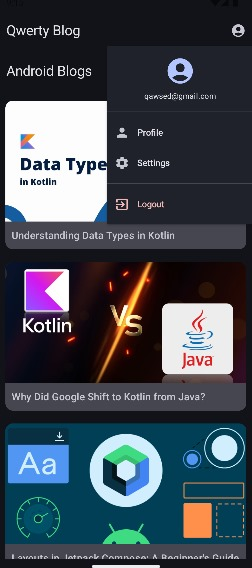
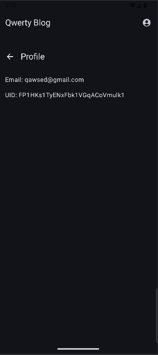
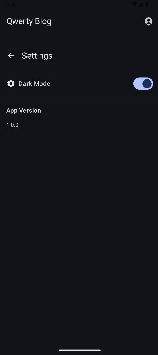
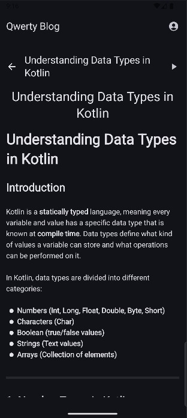

# 📱 Blog Application

A modern and accessible blogging platform built with **Kotlin** and **Firebase**, designed to provide a seamless user experience with features like text-to-speech for enhanced accessibility.

---

## 🖼️ Screenshots

### Splash Screen

### Login Page

### Registration Page

### Main Page

### Menu Options

### Profile Page

### Settings Page

### Content Page

### Accessibility Feature: Text-to-Speech

.jpg)

---

## 🚀 Features

- **User Authentication**: Secure login and registration using Firebase Authentication.
- **Blog Management**: Create, read, update, and delete blog posts.
- **User Profiles**: Manage personal information and view user-specific content.
- **Accessibility**: Integrated text-to-speech functionality for content accessibility.
- **Responsive Design**: Optimized for various screen sizes and orientations.

---

## 🛠️ Technologies Used

- **Programming Language**: Kotlin
- **Backend Services**: Firebase Authentication, Firebase Realtime Database
- **Architecture**: MVVM (Model-View-ViewModel)
- **UI Design**: Android XML layouts with Material Design components
